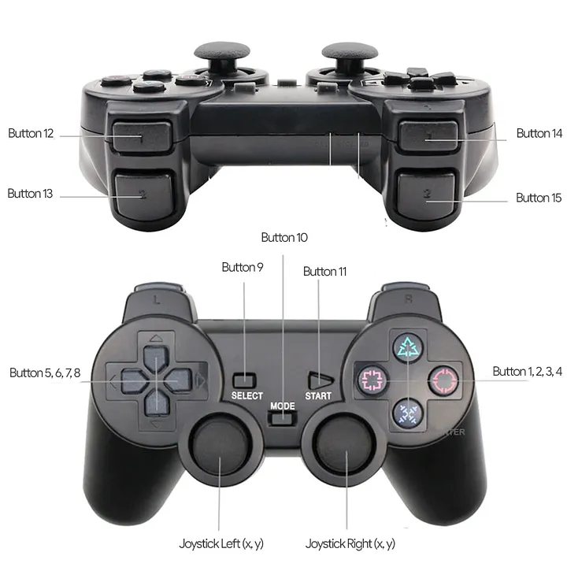

# Joystick Mouse Controller

A simple Python script that lets you control your mouse using a joystick. Joystick buttons are mapped to mouse actions like clicking, scrolling, and zooming.

All the buttons are customizable within the code.



[Joystick Image Source](https://kenjikawaida.medium.com/hid-report-descriptor-qu%C3%A9-es-y-c%C3%B3mo-usarlo-804d903d2c7f)

## Requirements

- Python 3.x
- pygame
- pyautogui

## Usage

1. Connect a joystick.
2. Run the script:
   ```bash
   python joytick_mouse.py
   ```

Enjoy!
